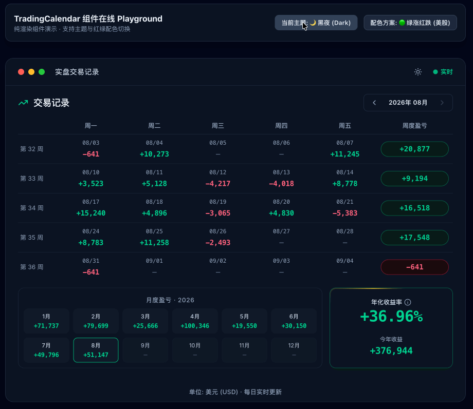

# react-trading-calendar

轻量、高性能、开箱即用的纯渲染交易记录日历组件 (React + Tailwind CSS v4)。支持美股/A股红绿配色切换、明暗主题、交易笔数 Hover 提示、移动端响应式布局。

[](https://github.com/szy0syz/react-trading-calendar)
[](https://opensource.org/licenses/MIT)



---

## ✨ 特性

- 🚀 **纯渲染零副作用**：全数据由 Props 驱动，组件内部不持有任何请求逻辑。
- ⚡ **交易笔数 Hover 提示**：支持设置每日交易笔数 (`tradesCount`)，鼠标悬停即刻浮现双主题响应的极简提示徽章。
- 🎨 **主题与配色**：支持 `dark` / `light` 主题，以及 `greenUpRedDown` (美股) / `redUpGreenDown` (A股) 涨跌配色。
- 📱 **移动端响应式**：窄屏自动隐藏周数列，月度面板切换为 4×3 布局，无横向滚动条。
- 📦 **轻量打包**：提供 ESM、CJS 及 TypeScript 类型声明，CSS 仅 ~6.5KB (gzipped)。
- 🔌 **高级扩展**：通过 `useTradingCalendar()` Hook 可在任意子树内消费全局 Context，支持二次封装。

---

## 📦 安装

```bash
pnpm add react-trading-calendar
# 或
npm install react-trading-calendar
```

---

## 💡 快速上手

```tsx
import { useState } from 'react';
import { TradingCalendar } from 'react-trading-calendar';
import 'react-trading-calendar/style.css';

export function App() {
  const now = new Date();
  const [year, setYear] = useState(now.getFullYear());
  const [month, setMonth] = useState(now.getMonth() + 1);

  const dailyRecords = [
    { date: '2026-08-04', pnl: -4709, tradesCount: 2 },
    { date: '2026-08-05', pnl: 11245, tradesCount: 12 },
    { date: '2026-08-06', pnl: 3523, tradesCount: 5 },
  ];

  return (
    <TradingCalendar
      year={year}
      month={month}
      dailyRecords={dailyRecords}
      colorScheme="greenUpRedDown"
      theme="dark"
      onMonthChange={(y, m) => { setYear(y); setMonth(m); }}
      onDateClick={(record) => console.log('Clicked:', record)}
    />
  );
}
```

---

## ⚙️ Props API

| 属性名 | 类型 | 默认值 | 说明 |
| :--- | :--- | :--- | :--- |
| `year` | `number` | 当前系统年份 | 视图年份 |
| `month` | `number` | 当前系统月份 | 视图月份 (1 - 12) |
| `dailyRecords` | `DailyRecord[]` | `[]` | 每日交易数据列表 |
| `weeklySummaries` | `WeeklySummary[]` | 自动按日累计 | 可选周度盈亏覆盖 |
| `monthlySummaries` | `MonthlySummary[]` | `[]` | 月度盈亏数据列表 |
| `annualSummary` | `AnnualSummary` | `undefined` | 年化收益总结 |
| `colorScheme` | `'greenUpRedDown' \| 'redUpGreenDown'` | `'greenUpRedDown'` | 涨跌配色 (美股/A股) |
| `theme` | `'dark' \| 'light'` | `'dark'` | 明暗主题 |
| `showThemeToggle` | `boolean` | `false` | 是否显示 Header 内的主题切换按钮 |
| `title` | `string` | `'实盘交易记录'` | 顶部窗口标题 |
| `statusText` | `string` | `'实时'` | 顶部状态文本 |
| `sectionTitle` | `string` | `'交易记录'` | 控制栏区域标题 |
| `currency` | `string` | `'美元 (USD)'` | 底部货币单位 |
| `updateText` | `string` | `'每日实时更新'` | 底部更新提示 |
| `onMonthChange` | `(year, month) => void` | — | 月份切换回调 |
| `onDateClick` | `(record: DailyRecord) => void` | — | 点击日期单元格回调 |
| `onThemeToggle` | `(theme: Theme) => void` | — | 主题切换回调 |
| `className` | `string` | — | 根容器附加类名 |
| `style` | `React.CSSProperties` | — | 根容器内联样式 |

### 数据类型

```ts
interface DailyRecord {
  date: string;            // 'YYYY-MM-DD' 或 'MM/DD'
  pnl?: number | null;     // 盈亏金额
  tradesCount?: number | null; // 交易笔数 (悬停浮现 "X 笔交易")
  isNonTradingDay?: boolean;
  note?: string;
}

interface WeeklySummary  { weekNumber: number; pnl?: number | null; }
interface MonthlySummary { month: number;      pnl?: number | null; }
interface AnnualSummary  {
  year: number;
  annualizedReturnRate: number; // 如 0.3696 = 36.96%
  totalPnL: number;
}
```

---

## 🔌 高级用法：二次封装

重构后的组件内置 `TradingCalendarContext`，允许在 `TradingCalendar` 的任意子树内直接消费全局配置：

```tsx
import { useTradingCalendar } from 'react-trading-calendar';

function MyCustomBadge() {
  const { colorScheme, theme } = useTradingCalendar();
  // ...
}
```

---

## 📄 License

[MIT](./LICENSE)
